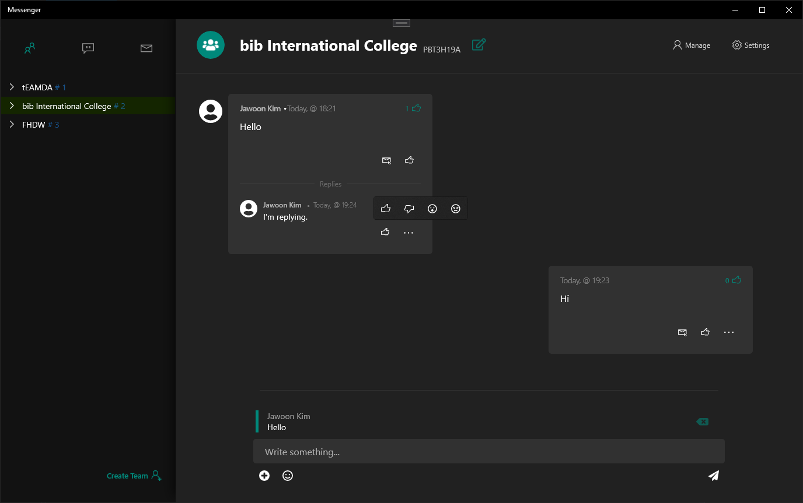

# BIB_VPR

A group messaging service inspired by Discord and Microsoft Teams.
Allows users to authenticate with their microsoft account

# Used technologies
- .Net(Core, Framework, ASP)
- Azure SignalR
- SqlServer
- Azure Blob Storage
- UWP

# Features
## Chat Model

This messenger allows users to chat in private chats and *teams*, which are divided into *channels*.
Teams hold the members and channels, channels hold the messages.

### Teams

#### Team Management
- Create/Delete teams
- Change team name
- Change team description

#### Member Management
- Invite members
- Remove members
- List members

#### Role Management
- Make/Remove user defined roles available to the team
- Assign/Unassign roles to members

#### Permission Management
- Grant/Revoke permissions to roles

### Channels
- Create/Delete channels
- Rename channels
- Pin messages to the top
- [Send Messages](###messaging)

### Private Chats
- Create/Delete private chat rooms between two users
- Pin messages to the top
- [Send Messages](###messaging)

### Messaging
- Send messages including emojis
- Edit messsages
- Delete messages
- Upload file attachments
- Send images, which are displayed in the chat view
- React to other messages with emojis
- Mention/Reference different entities like roles, messages

## Notifications
Notifications are sent when an event occurs either while the recieving user is offline
or not in the view where the event takes place(e.g. recieving a message from another
team)

- Collect and display notifications
- Go to origin of notification(e.g. channel where message was sent in)
- Mark notification as read

### Mentions/References
- Mention/Reference entitites like:
    - Users
    - Roles
    - A channel
    - The whole team
    - A message

## User profile management
Edit User data like:
    - User name
    - Bio
    - Email address
    - Profile picture

## Settings
- Switch between light and dark theme

# Screenshots

